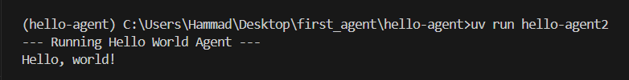

# Hello World Agent (using Gemini via OpenAI SDK)

This project demonstrates a basic "Hello World" agent built using the OpenAI Agent SDK, configured to interact with the Gemini API using the compatibility layer.

## Prerequisites

* Python 3.9 or higher
* UV package manager installed globally or accessible in your environment.
* A Gemini API Key (obtainable from [Google AI Studio](https://aistudio.google.com/app/apikey) or Google Cloud).

## Setup

1.  **Clone the repository:**

    ```bash
    git clone <your_github_repo_link>
    cd hello-agent
    ```

2.  **Create a `.env` file:**

    In the root `hello-agent` directory, create a file named `.env` and add your Gemini API key:

    ```dotenv
    GEMINI_API_KEY=your_gemini_api_key_here
    ```

    Replace `your_gemini_api_key_here` with your actual key.

3.  **Install dependencies:**

    Use UV to sync the project's dependencies

## Running the Agent

Use the UV script defined in `pyproject.toml` to run the agent:

```bash
uv run hello-agent2
```
##  Output Screenshot

> 
